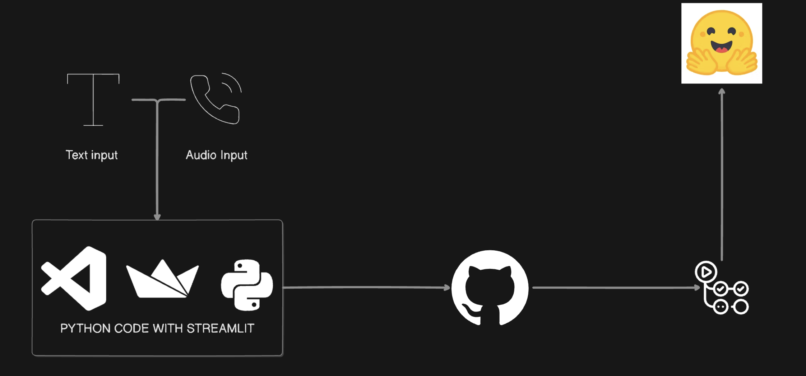

# Multimodal Sentiment Analysis System for Large Companies

This project aims to develop a comprehensive sentiment analysis system tailored for large companies, enabling them to extract and understand customer emotions from both text-based (emails) and audio-based (phone calls) interactions. By analyzing these customer interactions, companies can gain valuable insights to enhance their customer experience and satisfaction levels.

## Features
- **Email Sentiment Analysis:** Automatically analyzes the sentiment of customer emails to determine positivity or negativity.
- **Phone Call Sentiment Analysis:** Performs sentiment analysis on recorded phone calls to identify positive or negative feedback.

## Deployment
The project is deployed on the Hugging Face Spaces platform. You can access the application [here](https://huggingface.co/spaces/jokerthejoke/MACHINE-LEARNING).

## How It Works
1. **Data Collection:**
   - Emails and phone call recordings are collected from customer interactions.

2. **Data Processing:**
   - NLP techniques are used to extract text from emails.
   - Speech-to-text conversion tools are employed for phone call recordings.

3. **Sentiment Analysis:**
   - Sentiment analysis algorithms classify the text data into positive or negative sentiments.

## Technologies Used
- Python
- Streamlit
- Hugging Face Spaces
- Docker
- Transformers

## Usage
1. **Local Deployment:**
   - Clone the project repository from [GitHub](https://github.com/Sabry-Ahmed/MACHINE-LEARNING/).
   - Navigate to the project directory.
   - Run `docker-compose up` to deploy the application locally.

2. **Online Access:**
   - Access the application directly via the provided [Hugging Face Spaces link](https://huggingface.co/spaces/jokerthejoke/MACHINE-LEARNING).

## Future Enhancements
- **Database Integration:** Implement a database system to store analyzed data for future reference and analysis.
- **API Development:** Create an API to access the analyzed data and provide graphical representations of sentiment analysis results.
- **Enhanced NLP:** Enhance text processing capabilities to extract and analyze every word of the client's discussion, providing deeper insights into customer feedback.

## Conclusion
Given more time could be made to the Review Simplification Project. Integrating a database system and developing an API would facilitate data storage and access, enabling advanced analytics and visualization. Additionally, further enhancements to NLP capabilities would allow for more comprehensive analysis of customer feedback, leading to more actionable insights for businesses.

---

